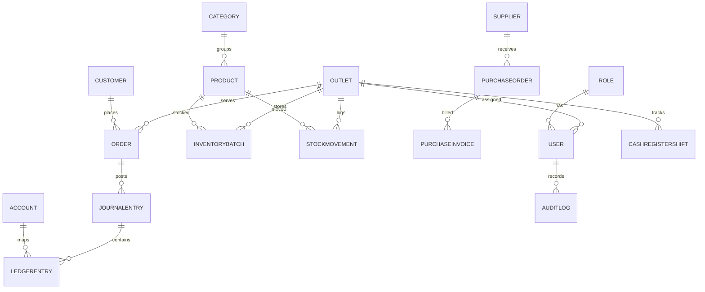

# ER Diagram (Mermaid)

```mermaid
erDiagram
  ROLE ||--o{ USER : has
  OUTLET ||--o{ USER : assigned
  CATEGORY ||--o{ PRODUCT : groups
  PRODUCT ||--o{ INVENTORYBATCH : stocked
  PRODUCT ||--o{ STOCKMOVEMENT : moved
  OUTLET ||--o{ INVENTORYBATCH : stores
  OUTLET ||--o{ STOCKMOVEMENT : logs
  SUPPLIER ||--o{ PURCHASEORDER : receives
  PURCHASEORDER ||--o{ PURCHASEINVOICE : billed
  CUSTOMER ||--o{ ORDER : places
  OUTLET ||--o{ ORDER : serves
  ORDER ||--o{ JOURNALENTRY : posts
  ACCOUNT ||--o{ LEDGERENTRY : maps
  JOURNALENTRY ||--o{ LEDGERENTRY : contains
  USER ||--o{ AUDITLOG : records
  OUTLET ||--o{ CASHREGISTERSHIFT : tracks
```
